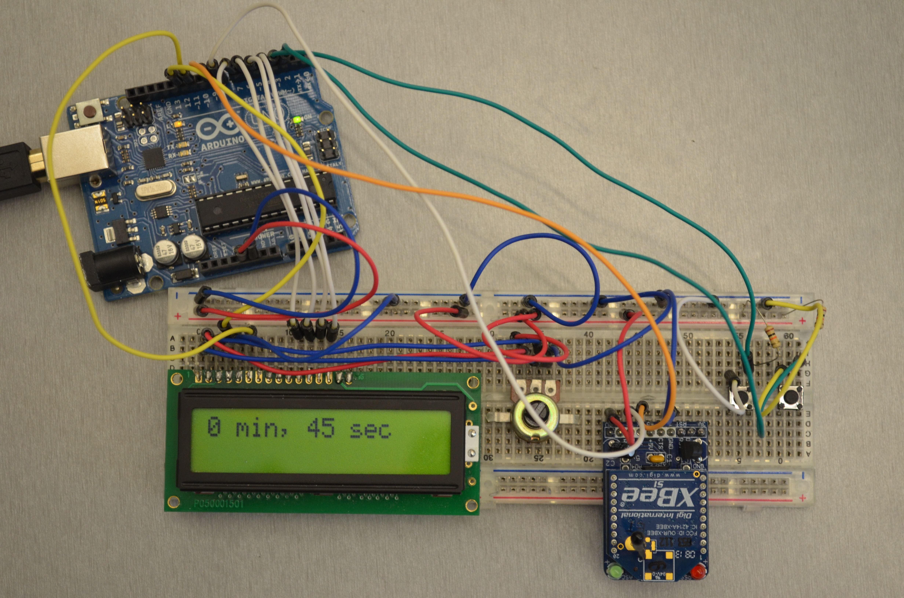
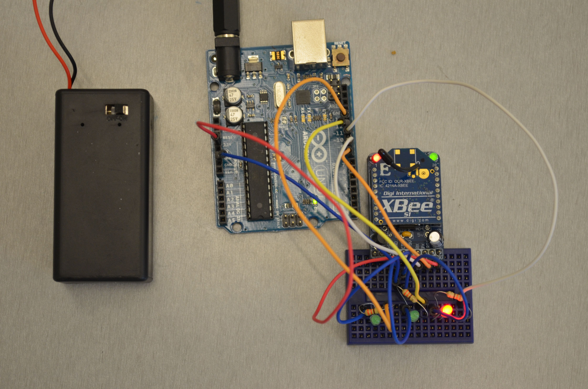

# Abstract

Use this DIY project to manage multiple time sensitive presentations by keeping informed the current presenter. PresenDuino uses two Arduinos to help time presentations.

## Presenter side

## Signal Side

