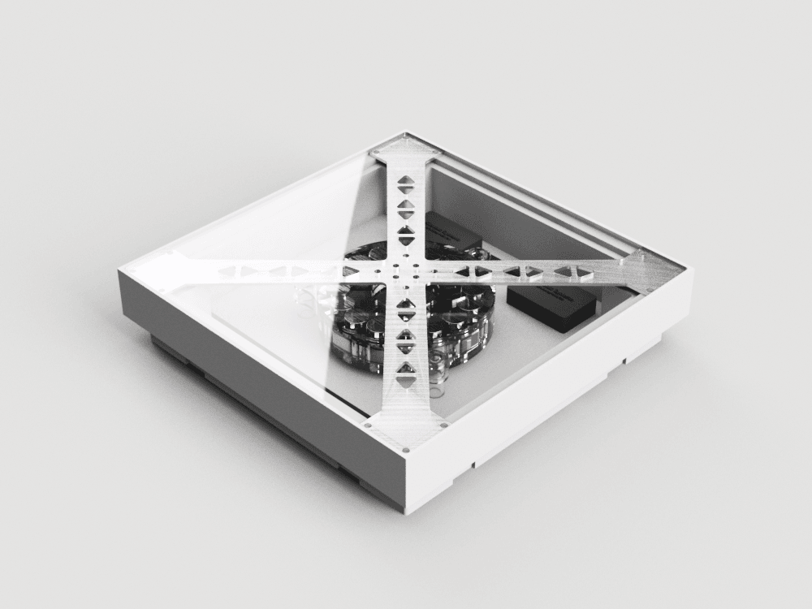
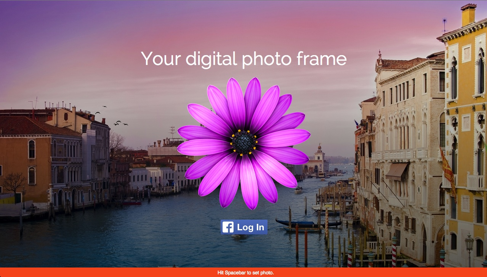

## KiloWalk

Kilowalk is a for-fun side project trying to explore use of kinetic energy from floor tiles to power to power environmental sensors. Our kinetic energy harvesting flooring converts a portion of the energy of footsteps into usable electricity, while our environmental sensors monitor the surroundings for ambient condition and air quality variations. Deployed at scale, the data in aggregate could be used to reveal the “pulse” of the city at a second-by-second, block-by-block resolution.

## PresenDuino

[Github link](https://github.com/HCDE498-598-Summer14/PresenDuino)

#### Presenter side

#### Signal Side

Use this DIY to manage multiple time sensitive presentations by keeping informed the current presenter.

## Digital Photo Frame

[Live Link](http://anikethanda.com/frame) *- Under progress*

Get some stock photography or use your pictures from Facebook to run a fullscreen slideshow on any screen. Now you can use your old tablet as a digital photo frame.