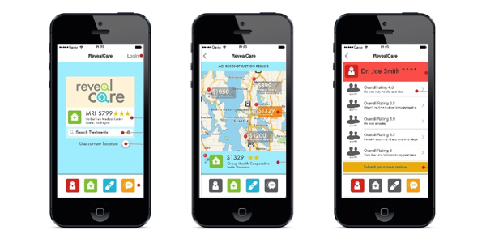

## Problem
The cost of health care in America has become an issue that affects the quality of life
of virtually everybody in the nation. In short, America spends about 18 cents of every dollar the economy produces on health care. This is almost twice the level of many of our fellow first world nations. More concern is that even after spending so much, the life expectancy in America is ranked at 33rd position.

## Research outcome
In a survey our team conducted, about 65% of our respondents said cost plays a deciding factor in their health care treatment, despite virtually all of our respondents having health care insurance of some form. Clearly, the cost of health care in America is unsustainable and something has to be done about it. Also we found out that people rely a lot on reviews about healthcare facilities and Doctors, especially from friends and family.

## Solution

  

RevealCare is a smart phone app that lets users to compare health care treatment costs within a map framework. It also allows users to search both facility and doctor reviews and to submit their own. RevealCare aims to help users make more educated purchasing decision around their health care treatments.