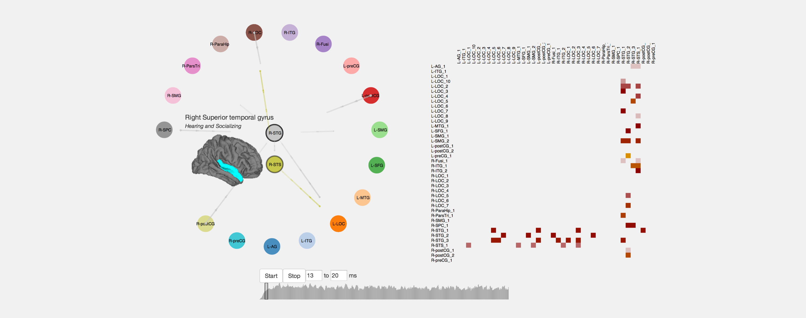

## Abstract
Understanding dense, time-varying networks lies at the heart of long-standing challenges in scientific domains, especially biology. We construct a focused visualization tool for neurological functional connectivity data. We apply multiple filtering techniques – animation and selecting by inclusion/exclusion - to make displays less overwhelming for general and expert audiences. We also allow filtering with a bootstrapped confidence level and support 2-way interactive visual hypothesis testing, to bring the noise and complexity of the data into context. Our animation display also supports casual use and inquiry into the underlying data for a general audience.

  

## Introduction
We sought to create a way to visualize this dynamic network flow as an interactive graph and accompanying diagrams. Existing network flows can be beautiful and useful; traffic flow is often visualized as network flow, as well as many other novelties such as wind, air traffic, and migration.
Within the neuroscience literature, many groups have designed neural visualizations, and the area has received more attention from visualization researchers more recently. One of the largest limiting factors of all of this data though is that it relies on arbitrary computer programs or hand-tailored videos that support - and never challenge - a designer’s hypothesis.
Many of these visualizations fail to express the data and effectively communicate it. Dense networks have too many edge crossings and it is very difficult for users to disambiguate connections. Time-varying data overwhelm static representations, and end-users have trouble without multiple levels of filtering tools.
Our mission for this project is twofold. We aim to improve on the techniques done by scientists to visualize network flow, and we also want to give the public a tool to explore network flow and evaluate it.
## Related Work
#### Layout

Most prior work focuses on showing data mapped onto the physical brain layout [5,6,12]. This takes advantage of expert knowledge in the domain to provide additional context without labeling or overlays. In neuroscience in particular many groups have their own region enumeration and descriptions, owing to the complexity and flexibility available to interpret gathered data. These techniques tend towards the goals of scientific visualization and focus less on interaction techniques. We considered the opposite side of the design spectrum, starting with a simple circle layout and allowing the user to experiment with different arrangements of nodes. Other prior work has used alternative layouts such as matrices [3,9] to compare different neurological functional connectivity datasets or show the network in general. Some shows

#### Complete Datasets

Prior work mostly shows complete datasets with few filtering features [8]. Some show small multiples of the graph at each timestep [11]. Work on dense, time-varying graphs has applied dotplots and other high-density techniques to attempt to show the full picture of the data [6] or used principal component analysis to generate smaller visualizations[10]. We start from an overview of the data and influence analysis to start small.
#### Uncertainty and Hypothesis Testing

Visual hypothesis testing presents visualizations generated from real and fake data for comparison; if the user can tell which one is real, the visualization is judged to show a potentially significant relationship[7]. Some prior work on functional connectivity starts the analysis from raw sensor data but does not incorporate null models or measures of uncertainty [2].
Prior work does not consider hypothesis testing for dense, time-varying networks. Work on financial time series of stock market prices showed that even causual users can determine real from fake data[4]. We did not show time series of our underlying data because permuting it created clearly null plots.
We are also unaware of work in visual hypothesis testing for networks in general. We chose to focus on interactive visual analysis testing and consider the tension between showing and filtering data according to significance levels derived from potentially flawed models.

## Domain: Neuroscience

We sought to capture the dynamics of network flow by examining a functional connectivity model of neurological activity. Functional connectivity measures the degree in which regions of the brain communicate or interact as they process certain events. Generally, our approach can be used to flow any time-varying network interactions, but we focused on this dataset to motivate our decisions.
The data comes from brain imaging experiments conducted at Massachusetts General Hospital. Subjects listen to an auditory stimulus to perceive whether they heard an English word or not. Paul A. Luce created lists of these stimuli and grouped them by how many words were just one phoneme (sound-specific letter) different and how often its constituent phonemes were present in the language [1]. While subjects did this task, their neural activity was recorded by electrical and magnetic sensors (EEG and MEG).
Neural activation was mapped on to the grey matter surface and clustered into 40 nodes. Figure 2 shows the neural activity at two nodes. The waves of cortical activity were used to measure functional connectivity by using a Granger causality model using Kalman filters. The data we received from MGH is the measure of connectivity from the first 600 milliseconds after the subject starts to hear a word, conditioned by different word groups.
This is where our analysis comes in. The data demonstrating the interaction between nodes is very noisy, due both to the nature of the sensors as well as the multi- layered processing required to convert the readings into associated estimates for regional brain activity. Determining which apparent interactions represent meaningful relationships remains a significant challenge for the field. We explored transforming the data in a few ways to measure a sense of significant connections.
As illustrated in Figure 3, the functional connectivity model produces results as a time-varying value called the Granger causality index (GCI) for each pair of neural regions A and B. Values greater than zero show signs that region B could be caused by region A, values less than show otherwise but their magnitude is, in isolation, meaningless.
By taking the cortical activity data, randomly shuffling the values, and putting it back into the causality model, we produced a distribution of GCIs of clearly non-causal data, but with the same underlying values. The distribution of experimental GCIs has a mean of -0.018 and a standard deviation of 0.089 while the null dataset had a mean of 0.003 and a standard deviation of 0.050, with 3.8 million data points in both sets. Figure 4 illustrates the distribution of GCI values in the experimental model (light and dark green) and the null model (dark green and blue).
Thereby, the majority of the dataset’s values, including many of them above zero, can very well be produced by random noise. As a backwards t-test, we filtered the data by rejecting all signs of causality with a GCI below the 95th (0.0733) or 99th (0.1228) percentile of the null-models GCIs. This creates a binary condition (significant evidence of causality or no) for each region to region connection over each time point. Thereby, at each time point, there is a directed edge from node A to node B if there is statistically verified evidence of functional connectivity.

## Methods

The program that we developed takes the three-dimensional data (nodes x nodes x time) and gives the user an array of techniques to interact with it.

#### Packet Visualization

Visualizing dynamic network data is hard to do with static edges. Previous work attempted to modify the width of edges dynamically1. The overloaded display had poor visual cues of change and, due to the high number of interactions in the neurological dataset, edge crossings obscured important data.
In order to give the user a sense of network flow while minimizing edge crossing, we turned the edges into invisible paths for short edges/arrows to move across. For functional connectivity, these represent packets of information moving across regions of the brain.
Although the packet approach is aesthetically motivated, there are trade-offs. The rendering used for the packets in our implementation does not give the user much interaction with the lines themselves and although the user can pause the display, the packets themselves do not. Greater control over the timing of packets and tighter integration with the time controls could really enhance the ability for users to interact with the temporal data.

_Relationship to Dot Plots_

Dot plots show time series data by showing a single point denoting presence or absence at some time. The packet visualization can be seen as a kind of dot plot. If we took the entire time window of the dataset, each edge would show a dot plot for the presence / absence of the edge at each time step.
#### Brushing and Filtering
In order to explore a 3D dataset, slices in space and time assist users in breaking down otherwise overwhelming data presentation. Two brushing techniques are implemented in our program, one for selecting subsets of regions and another for selecting time.
Nodes have two states, on and off. Nodes that are on will produce packets and display neural activity going between nodes. By clicking the mouse and dragging a rectangle over nodes in the display, the state of each node will be toggled on/off (as an exclusive or) once the mouse is released.
Time can be interacted with as well, by allowing the user to interact with a timeline in the bottom of the screen. The user can brush areas in the timeline to specify when the animation starts and how long it should be. This behavior is best done while the simulation is stopped. The timeline also displays the aggregate amount of interaction happening over time.
#### Node Layout

The placement of nodes is crucial to mitigate edge crossing and highlighting specific effects. Due to the dense nature of the graph, we chose to simplify the layout by drawing nodes in a circle, combining nodes within regions, and allowing the user to edit the placement of nodes.
Most displays of neurological activity are shown on the brain itself. That maintains context well and experienced users can easily recognize familiar areas, but these displays offer little context for users. In our approach, we put the images of the brain in tooltips while the user hovers over a node and added information about the approximate roles of each area.
The user can change the placement of nodes by clicking and dragging. This opens up the visualization to highlight specific activity to areas. For example, in Figure 8, the user has moved nodes so that the LOCs (Vision areas) are together) and areas in the lower part of the right hemisphere are in the center so their specific trails can be seen. These areas are associated with objects and socializing and they are communicating a lot with the vision areas. This could affirm a hypothesis that the user is recalling the visual representation of the words while they process them. A lot of activity is being sent to the left hemisphere’s supramarginal gyrus (SMG) also known as Wernicke’s areas, which is implicated in linguistic processing as well.
####Context and Aggregation
While we dealt with edge crossing by allowing direct manipulation of node layouts, matrix representations plot the absence or presence of edges in the graph without overlap. We show the matrix representation of the graph and link it to the same time window as the node plot. Source nodes are plotted by row and target nodes appear as columns.
Instead of showing only absence and presences of edges, we give an indication of strength via a color encoding. The color encodes the number of edges coming from the source node (shown by rows) divided by the total number of edges coming from all nodes.
We also grouped the brain regions into larger super regions for the node layout. The matrix shows the sub-regions of those larger regions and orders the nodes by those regions.

## User Study
We did an informal user study on the interface to see how well it did. Although we sought to provide ways for people to break down the dynamic network data, it still overwhelmed the user. The proper usage of some elements was unclear so we added information tips for the final product. Furthermore, some interaction techniques weren't linked quite right or the links were no transparent to the user. The matrix representation was hard to understand and may not contribute to understanding data in its current form. In the end, it looks like we put all the data out there, but this display is not ready for the general audience.

## FUTURE WORK
#### Performance and Large Datasets
The tool computes aggregate metrics locally for the matrix representation. This constrains it to work with small graphs. If multiple users analyze the same data, otherwise local computation may be hosted in the cloud, especially for larger datasets. Streaming a user interface across the cloud still stutters due to latency, and prior work has shown that increased latency negatively impacts the breadth and variety of hypotheses explored during the analysis process. We can split the middle with techniques similar to those demonstrated by Immens[4], which calculates binned aggregations and sends that data for local computation and display. Thus, there opportunities for adapting the metrics we compute and other metrics to show with the matrix for large time-varying graphs.
#### Visual Hypothesis Testing
While the current implementation supports setting up a 50/50 visual analysis test, It lacks features to share analysis tests over the network. We imagine distributing analysis keys or a unique URL to remote participants or through services such as Mechanical Turk. We could support branching trees of analysis, multiple null models. Users may also benefit from an environment to interpret the results of the tests, especially as the space of expressible test sets expands.
Visual analysis testing may produce richer results by recording the depth and other interaction characteristics that users chose from. In this work we plan to measure standard measures of analysis tasks and attempt to at best model and at least cluster the behavior patterns, to guide the interpretation of visual analysis testing results. For example, how does a person’s belief in a hypothesis vary with the time spent judging it? How does this vary across individuals? What empirical distributions do the judgments of individuals follow? What if two or more people collaborate in judging a hypothesis? Some hypotheses we hope to test include: 1) time spent analyzing first increases the chance a person will judge the hypothesis true, then decreases, 2) people collaborating in person will be more likely to agree than they would compared to collaborating remotely, even when partially controlling for confounding factors such as sharing or not sharing a workstation or including high definition video conferencing, 3) individual differences in analysis styles, quantified by the amount of branching and time spent in different analysis paths, will predict their responses for certain kinds of data, and 4) casual visual hypothesis test results, aggregated over a large number of people, provide a unique signal potentially useful when combined with other, more traditional analysis methods.
We also want to explore showing null data to users unaware of whether it is real or fake data from the beginning of analysis. If we tell them it is real data, after analyzing it for a while, can they tell it is actually a null model? How does this vary across domain expertise?

We also plan to explore sonification, both in active (quick changes / small samples) and passive listening modes (long durations), as a potential way to derive a unique signal for analysis. This and other non-traditional ways for the public to interact casually with science present unique design and interaction challenges, such as along the active – passive experience dimension. Raising awareness and hopefully interest in scientific issues, especially uncertainty and validity of data, can lead to broader impacts. We are also interested in exploring other complex datasets with these techniques, such as the time-varying interactions on social networks.

## Conclusion
Interactive techniques are some of the best ways for users to break down three dimensional datasets. Our exploration of the functional connectivity dataset produced visualizations that gave users the ability to explore the data. Processing the data for significance is important, as much of the data is noise. Novel visualization techniques such as packets enable the user to view the data in a new way, but not without tradeoffs. Much like improving the statistics of the underlying data, visual hypothesis testing is important to validate any claims that come from visualizations like these. Although much more work could be done to enhance the visualization, we have provided a new set of interactions to explore functional connectivity.
## Acknowledgements

We thank David Gow and Bruna Olson at Massachusetts General Hospital for generously sending their functional connectivity dataset for us to manipulate and visualize. We would also like to thank the authors of D3 for giving us such a powerful tool for web-based data manipulation and interaction. Lastly, we'd like to thank our outstanding professor Jeffrey Heer and teaching assistant Kanit Ham Wongsuphasawat for giving us such an informative and fun course for which we did this project.
## References
1. Luce, Paul A, Large, Nathan. Phonotactics, density, and entropy in spoken word recognition. Language and Cognitive Processes (2001).
2. E W Anderson, C. Chong, G. a. Preston, and C. T. Silva, “Discovering and visualizing patterns in EEG data,” 2013 IEEE Pacific Vis. Symp., pp.105–112, Feb. 2013.
3. B Alper,B.Bach,N.HenryRiche,T.Isenberg,andJ.- D. Fekete, “Weighted graph comparison techniques for brain connectivity analysis,” Proc. SIGCHI Conf. Hum. Factors Comput. Syst. - CHI ’13, p. 483, 2013.
4. J  Hasanhodzic, A. Lo, and E. Viola, “Do humans perceive temporal order in asset returns?”. Preprint 2011, http://jasminah.com/Papers/aroraV4.pdf
5. F Janoos, O. Irfanoglu, R. Machiraju, and I. Morocz, “Visualizing Brain Activity from fMRI Data.” Technical Report
6. C Nowke and M. Schmidt, “VisNEST—Interactive analysis of neural activity data,” Biol. Data, 2013.
7. H Wickham, D. Cook, H. Hofmann, and A. Buja, “Graphical inference for Infovis.,” IEEE Trans. Vis. Comput. Graph., vol. 16, no. 6, pp. 973–9, 2010.
8. M Xia, J. Wang, and Y. He, “BrainNet Viewer: a network visualization tool for human brain connectomics.,” PLoS One, vol. 8, no. 7, p. e68910, Jan. 2013.
9. E Nordlie and H. E. Plesser, “Visualizing neuronal network connectivity with connectivity pattern tables.,” Front. Neuroinform., vol. 3, no. January, p. 39, Jan. 2010.
10. S Mikula and E. Niebur, “A novel method for visualizing functional connectivity using principal component analysis.,” Int. J. Neurosci., vol. 116, no. 4, pp. 419–29, Apr. 2006.
11. L Li, S. Seth, I. Park, J. C. Sanchez, and J. C. Principe, “Estimation and visualization of neuronal functional connectivity in motor tasks.,” Conf. Proc. IEEE Eng. Med. Biol. Soc., vol. 2009, pp. 2926–9, Jan. 2009.
12. W.-K. Jeong, J. Beyer, M. Hadwiger, A. Vazquez, H. Pfister, and R. T. Whitaker, “Scalable and interactive segmentation and visualization of neural processes in EM datasets.,” IEEE Trans. Vis. Comput. Graph., vol. 15, no. 6, pp. 1505–14.