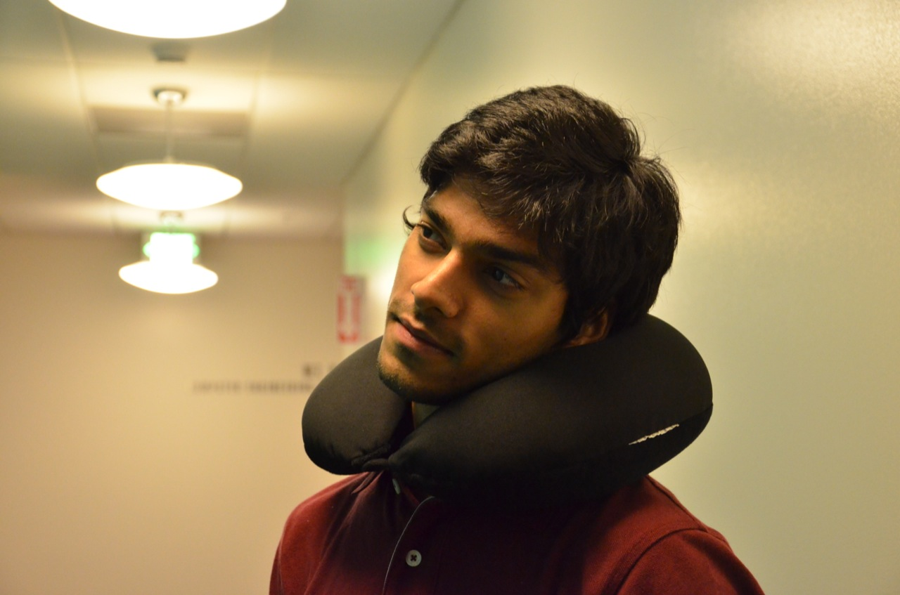
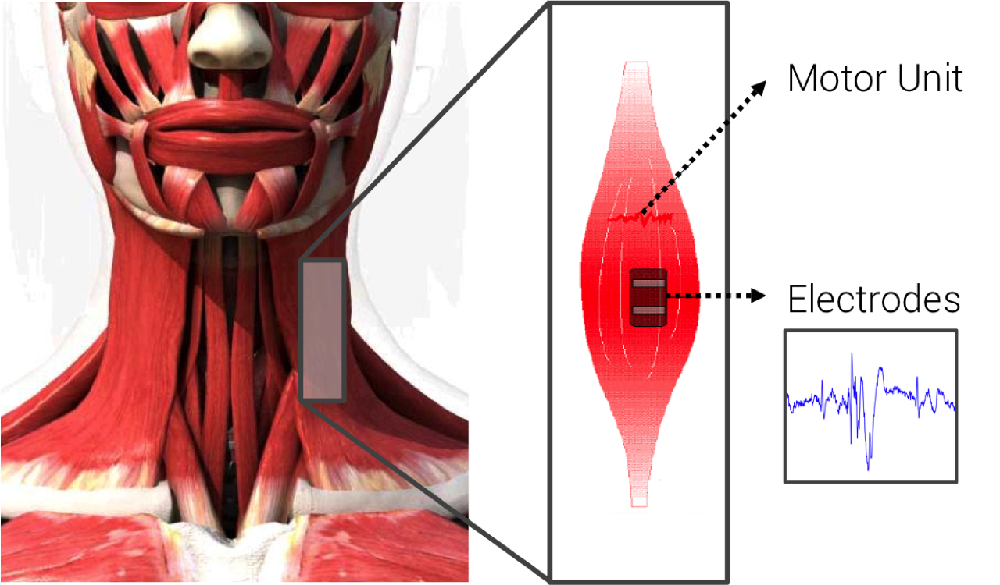
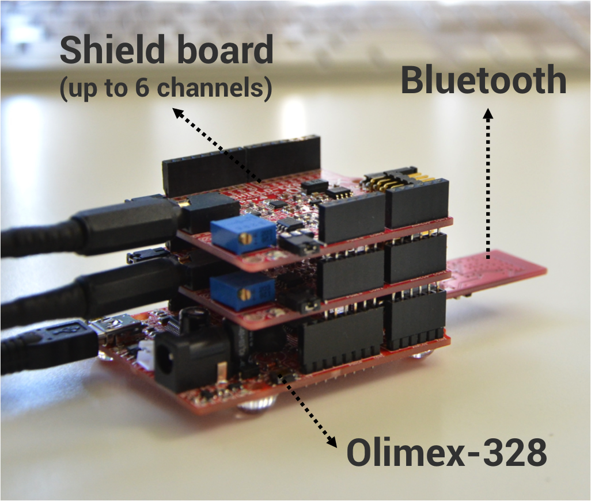
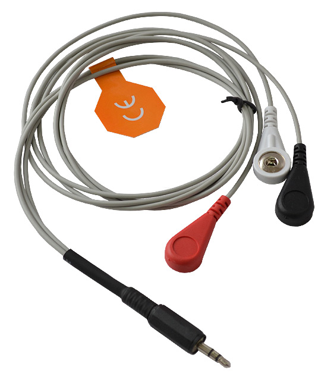
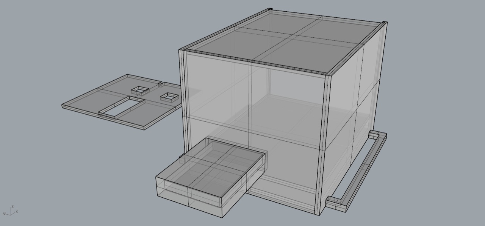
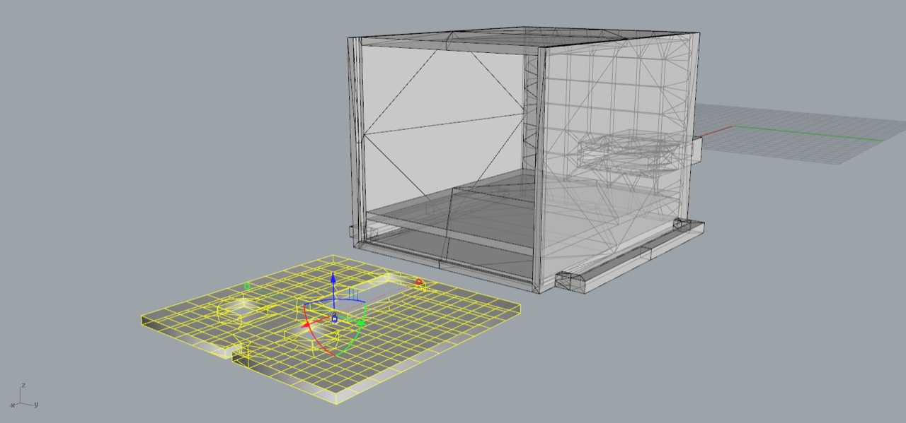
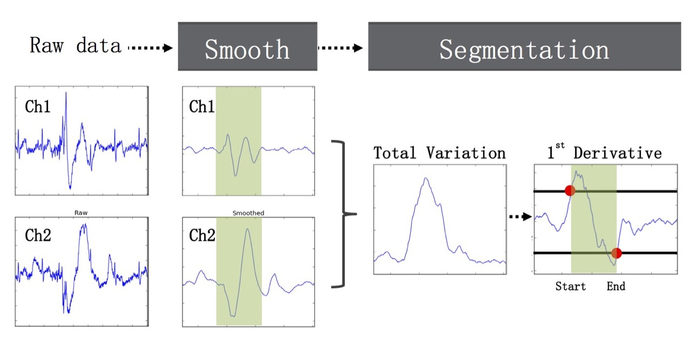
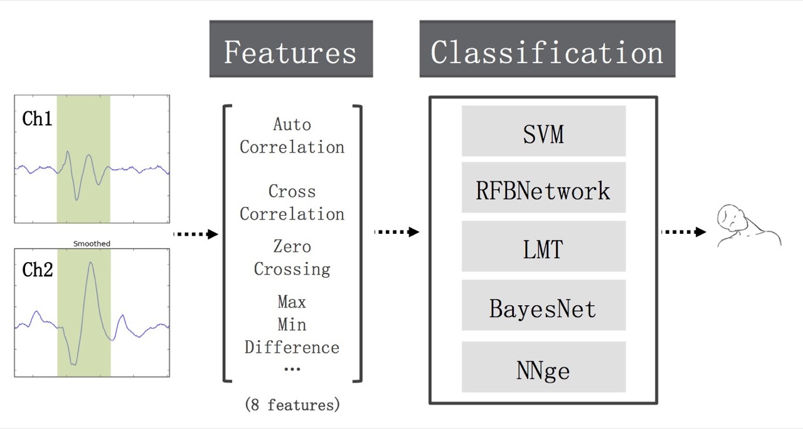

  <iframe src="//player.vimeo.com/video/98090453?title=0&amp;byline=0&amp;portrait=0" width="100%" height="100%" frameborder="0" webkitallowfullscreen mozallowfullscreen allowfullscreen></iframe>

## Introduction

Neck is one of such part of our body that densely packs tons of information. It is the neural pass of the body; it can move, give vocal data and provide heart rate information. We envision a device that can tap on this information and result in a novel input technique while also keeping a track on health data. The interaction can be fast enough enabling hands-free interaction while both hands are not accessible. In addition, it is possible to use this wearable device for health sensing, for example, monitoring the tiredness, heart rate or even muscle stress. It can take many forms, such by being part of the clothing collar or in a form of a pendant. It can also used as a accessibility device for special people who cannot move lower part of their body or people aging with disabilities.

  

Our current product is good at recognizing short neck gestures, it is always available with a ‘faster in’ and a ‘faster out’. Currently it detects basic gestures including up tilt, left tilt, and shaking. The device connects via Bluetooth and send sEMG data to the connected client device. The client then processes this data to recognize gestures.

## Envision NecX

We envision NecX to be a wearable device that can take many forms, such by being part of the clothing collar or in a form of a pendant or a pillow. The interactions using neck might not be as socially awkward as by other wearables in the market. We also plan to focus on providing accessibility to special people who cannot move lower part of their body.

For people aging with disabilities or with spinal cord injuries, their mobility is limited and their involvement to the environment is constrained. These limitations result from the environmental barriers that hinder their full participation in society and even their daily life. However, we think that such disability should not be tied to a person. NecX is made to help to overcome these barriers.

Apart for using it as an aid to mobility of the elderly or with people suffering from spinal cord injuries, we also see this technology being used in Gaming, Eyes-free computing, and as a mobile phone peripheral for short interactions. It can used for more immersive gaming experience, monitoring neck muscle tension levels, perform hands-free interactions with mobile devices. We expect this wearable device can be used as a health monitoring tool and a hands-free input device. This device is capable of capturing the user’s heart rate and detecting muscle stress even when the head and neck is stationary; by simply perform a neck gestures, the user is able to pick up a call or change the volume of the songs while keep the phone in the pocket.

## Our Approach

  

### sEMG

To enable a novel input device that also provides health monitoring and hands-free interaction, our system uses surface Electromyography (sEMG) to achieve such capabilities.  When muscle is stressed, a current issued from the brain flows through the muscle. By attaching electro pads to the target muscle (in our case, on both side of neck), the current will flow through the pads and will be picked by our sensor board. Our algorithm captures these signal variations when the muscle is in action and uses it for gesture detection and classification. Different from the previous study, we used only 2 channels of sEMG data to enable such functions. We believe reducing the number of channels can provide more flexibility in design a new form factor and also extend the power consumption.

### Hardware

To measure the sEMG on the neck, we use the OLIMEXINO-328 and two SHIELD-EKG-EMG boards, each of which collects sEMG data from one side of the neck. Electrode pads are attached on the user’s neck; the red pad (positive) and black pad (negative) are instrumented on the side of neck and white pad (ground) is attached on the back of the neck. 

  

  

Instrumenting the white pad behind the neck (i.e., at a neutral position) can reduce ambient noise. The Olimex-328 is an Arduino-based motherboard and has a 10-bit ADC on board. We sample the analog data at 256 Hz, which is sufficient for our use case as we expect a neck gesture should be relatively slow. Finally, the data are streamed to a laptop for gesture recognition through Bluetooth. To better understand the capability of Olimex-328, we simulated the circuit in MultiSim and verify that the board has a low pass filter with the cut-off frequency of 3.4 kHz (see Fig). We also designed a 3D-printing case for this prototype.

  

  

## Gesture Detection & Classification

As described earlier, any muscle movements on neck causes a current flowing through the electrode pads, which raises the output voltage from the Olimex-328 board. When muscle relaxes, the voltage drops to the baseline. Our first step is to identify signal variations, and to recognize an event of muscle excitation.

The following figure shows the process of gesture segmentation:

  

After an event is detected, features are extracted from the recognized segment. We chose various features for gesture classification: 

  

The offline analysis described above shows the feasibility of using NecX to detect and classify neck gestures; we also want to demonstrate the ability for NecX to work in real-time. We implemented a real-time version of our system and designed a few prototype applications. In order for NecX to run in real-time, we modify the classifier to enhance the robustness against any possible noise. In the video figure, we showed the on-the-fly neck gestures recognition and used NecX to play Tetris and to detect heart rate and muscle stress. 

