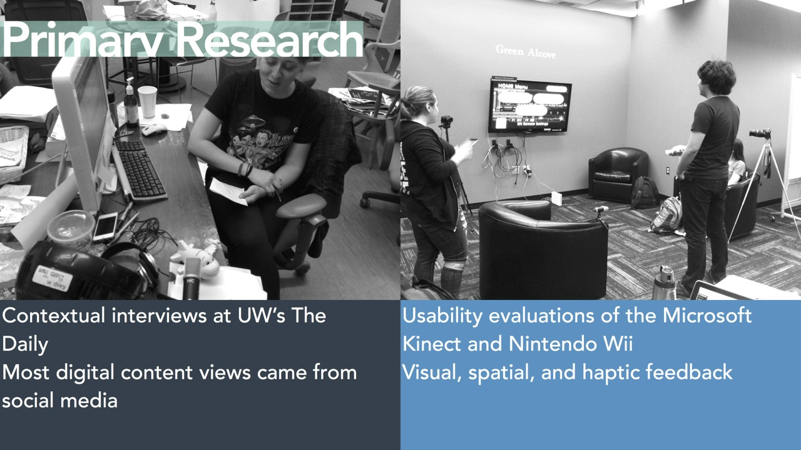
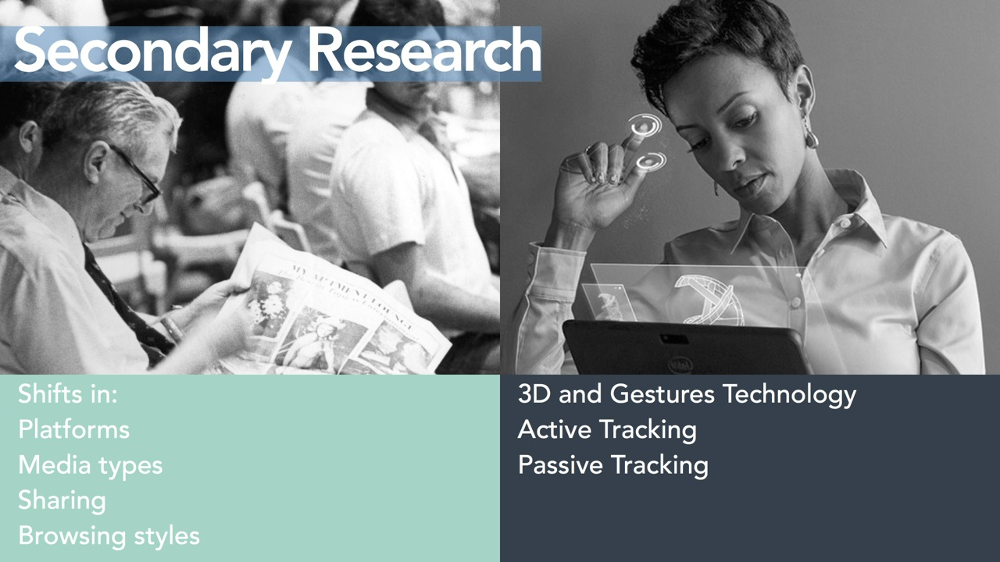
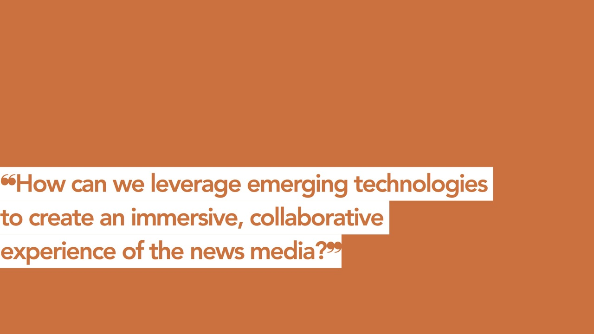
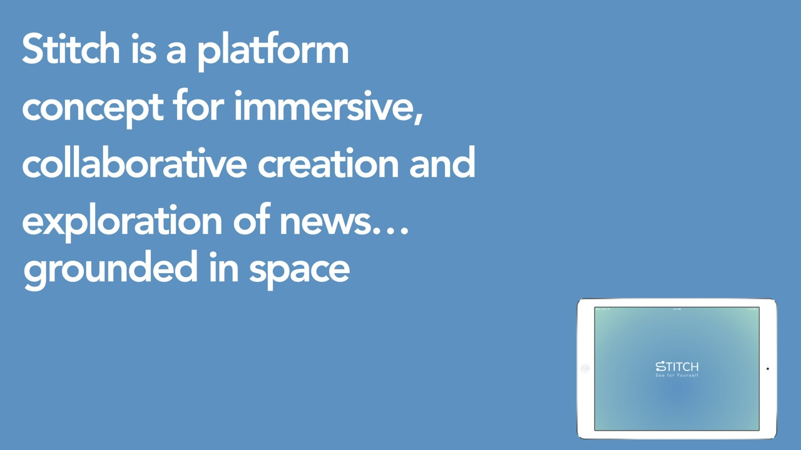
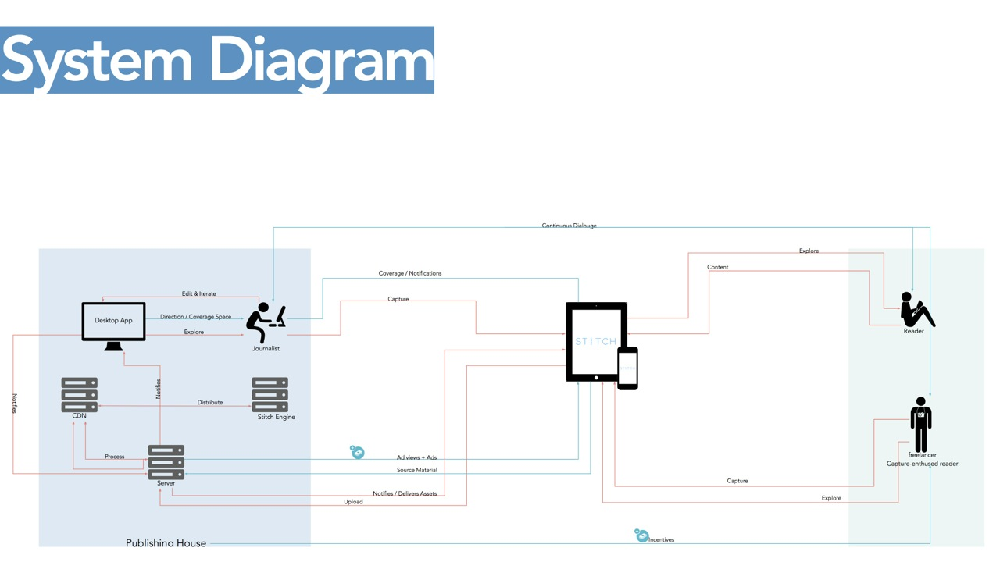
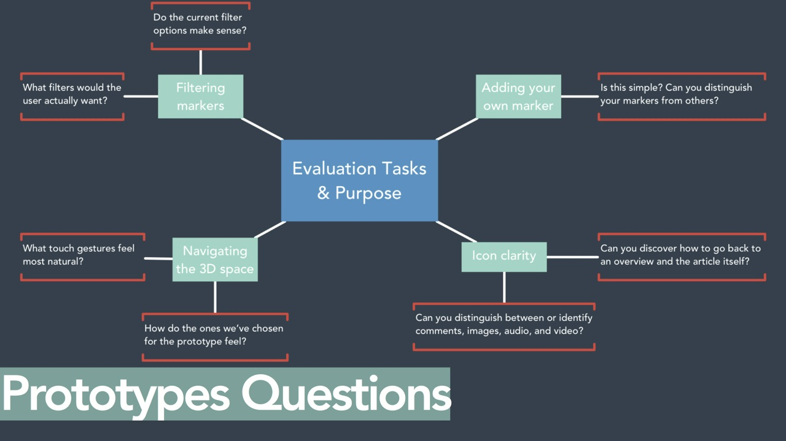
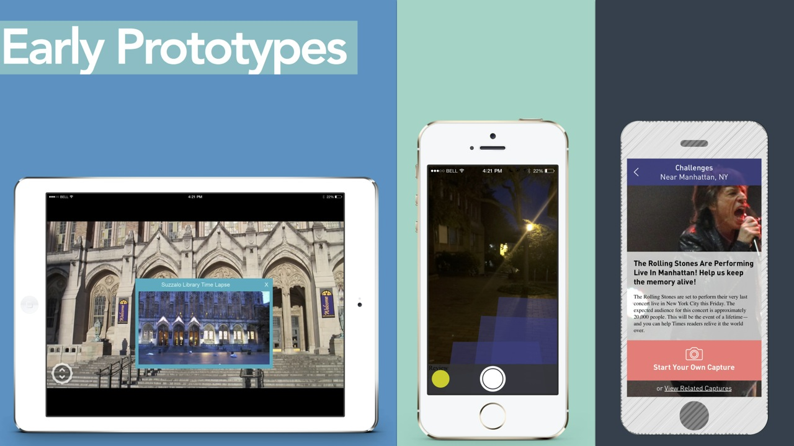

  <iframe src="//player.vimeo.com/video/103798732?title=0&amp;byline=0&amp;portrait=0" width="100%" height="100%" frameborder="0" webkitallowfullscreen mozallowfullscreen allowfullscreen></iframe>

## Introduction

The capstone project during MHCI+D focused on promoting novel applications of 3D image capture and touch gesture technology in the news publishing industry. My team partnered with Intel, who challenged us to envision a system that creates value for their upcoming RealSense depth-sensing camera in the News publishing industry. 

Before hopping onto secondary research we evaluated existing spatial sensing platforms, and meanwhile also researched current publishing industry.

  

Then, our secondary research highlighted that the way people consume news is changing, due to its online access. However, the current news business model still supports print-based news, rather than digital. On the other hand, emerging technologies are enabling more immersive, collaborative experiences.

  

We combined these insights to form the following design question.

  

Our design response was Stitch:

  

We conceptualized the whole system but concentrated on one part of it which dealt with exploration of news media on a tablet. Following the system diagram.

  

To refine the solution we iterated by developing functional prototypes backed by user testing and evaluation. We took the help of rapid prototyping to answer the following questions:

  

## Prototyping

Before developing the final prototype we had several iterations of prototypes at increasing level of fidelity.

  

The final explore prototype supported the following interactions:

### Select an Article

View the journalist-curated list of immersive articles and select to read more about it with 3D reconstruction in the background.

  <video width="100%" loop autoplay>
    <source src="./movie-trims/article.mp4" type="video/mp4"/>
    <source src="./movie-trims/article.webm" type="video/webm"/>
    Your browser does not support HTML5 video.
  </video>

### Fly-in

By tapping on start user dives down into the 3D reconstruction of the relevant place where the news took place. Fly-in gives a spatial perspective to the user.

  <video width="100%" loop autoplay>
    <source src="./movie-trims/fly.mp4" type="video/mp4"/>
    <source src="./movie-trims/fly.webm" type="video/webm"/>
    Your browser does not support HTML5 video.
  </video>

### Navigate 

Exploring a digital reconstruction of a news story’s environment as a way to deepen understanding of a situation, event, or location.

  <video width="100%" loop autoplay>
    <source src="./movie-trims/nav.mp4" type="video/mp4"/>
    <source src="./movie-trims/nav.webm" type="video/webm"/>
    Your browser does not support HTML5 video.
  </video>

### Content Markers

View multiple perspectives on the news through dynamic journalist and reader-contributed content. Linking these content markers together can generate Walkthroughs, which help create a story that users can follow.

  <video width="100%" loop autoplay>
    <source src="./movie-trims/marker.mp4" type="video/mp4"/>
    <source src="./movie-trims/marker.webm" type="video/webm"/>
    Your browser does not support HTML5 video.
  </video>

### Filter Markers

Filters helps in focusing on the content markers that matter the most. This protects users from getting overwhelmed by large number of markers.

  <video width="100%" loop autoplay>
    <source src="./movie-trims/filter.mp4" type="video/mp4"/>
    <source src="./movie-trims/filter.webm" type="video/webm"/>
    Your browser does not support HTML5 video.
  </video>

			
