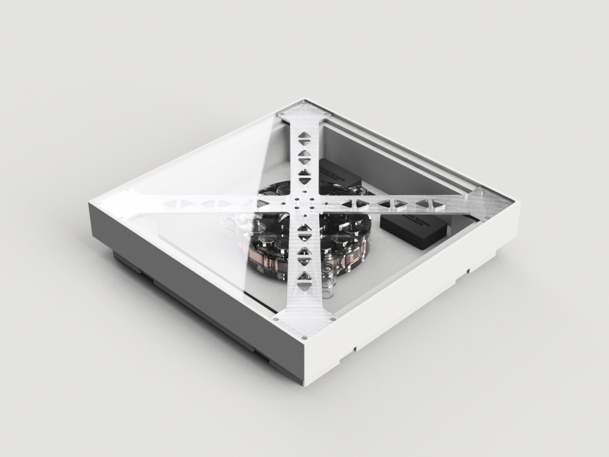

# Abstract

Kilowalk is a for-fun side project trying to explore use of kinetic energy from floor tiles to power environmental sensors. Our kinetic energy harvesting flooring converts a portion of the energy of footsteps into usable electricity, while our environmental sensors monitor the surroundings for ambient condition and air quality variations. Deployed at scale, the data in aggregate could be used to reveal the “pulse” of the city at a second-by-second, block-by-block resolution.