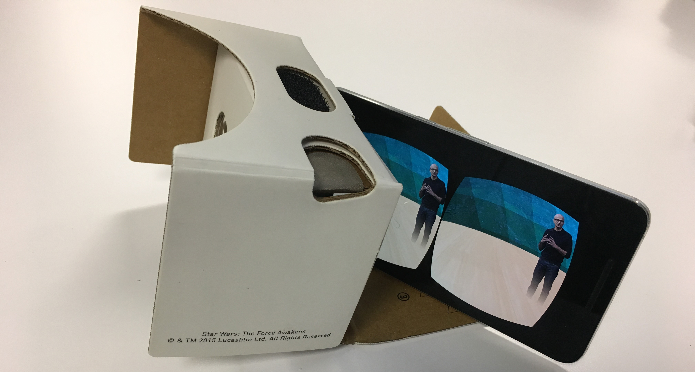
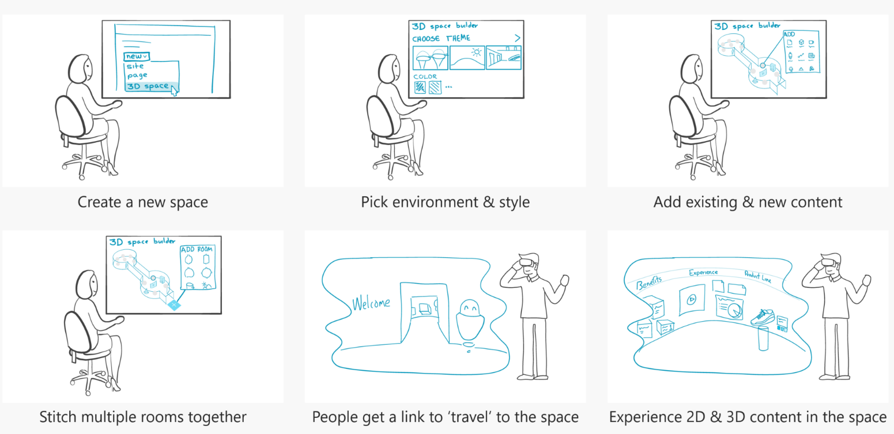
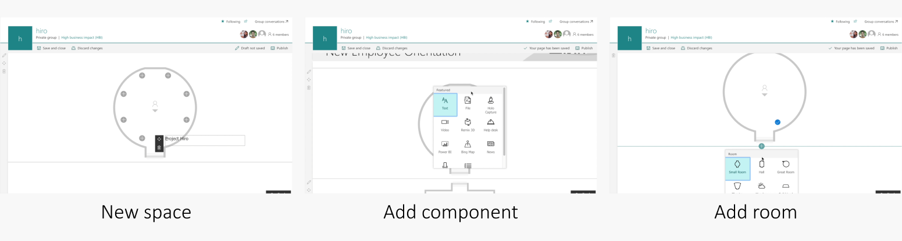
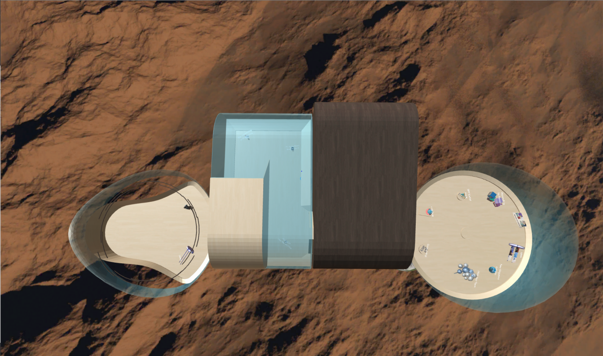
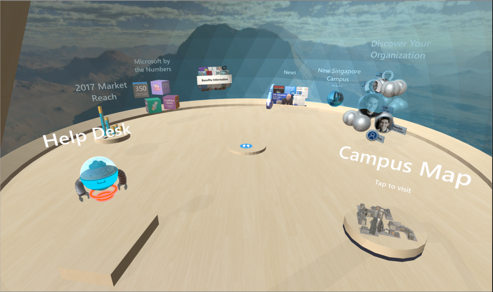

  

# Abstract

Our team of 5 was challenged with envisioning future of OneDrive & SharePoint in AR/VR Metaverse. We went broad to explore various scenarios and shortlisted on __Democratizing Creation and Consumption of 3D spaces__. The project concluded with running a Concept Validation Testing using a functional prototype, which resulted in funding of SharePoint Spaces.

# Scenario key bets
 - Anyone in an organization should be able to create, share and consume a 3D space.
 - Creators won't require skills in Unity3D or WebVR to create beautiful 3D spaces.
 - Leverage existing SharePoint framework to boost user familiarity and product development.
 - True to 3D content. Richer with 2D content.
 - Showcase static and well as dynamic user content.

# Flow

  

# Authoring

  

# Consumption

  

  

