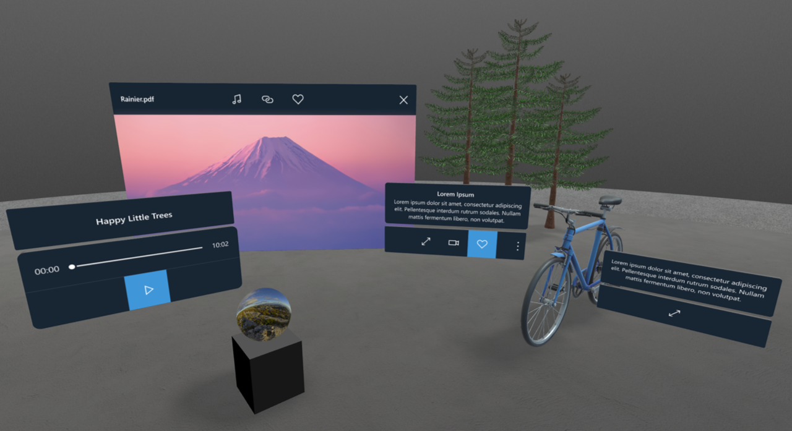
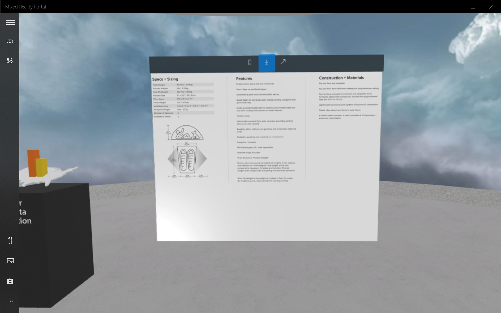
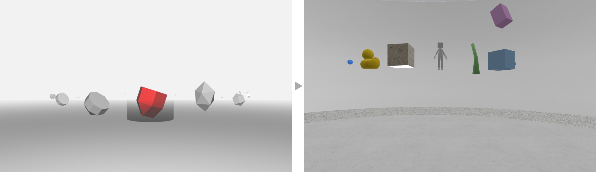

# Abstract
SharePoint spaces empower creators to build and share immersive experiences with point-and-click simplicity. You can get started with smart templates to create a mixed reality environment complete with beautiful surroundings, ambient sounds, rich textures, and lighting. You then add content, which can include files you already have in SharePoint, allowing you to repurpose your existing 3D models, 360 degree content, documents, and images. This project spun out of [Project Hiro](/Project-Hiro).

<!---
#### A sample space created using Spaces

  

  <iframe style="border:none;" width="100%" height="640px" src="https://www.exploresharepointspaces.com/sample-classroom" />

--->

# Role
Founding member and sole UX Engineer of the project responsible for Prototyping, Design and Integration of following features.

# 3D Common Controls
To build a cohesive set of 3D common controls I represented the team at companywide Mixed Reality design forum. My experience from Fabric/Fluent UI Library helped us develop these Atomic controls that work flawlessly in Mobile, Desktop and HMD.

  

# Interaction model
The challenge was to build a system that just works for someone new to Virtual Reality; while making sure authors and third-party developers have enough create creative freedom to create valuable and beautiful spaces.
To solve this, I extensively prototyped various interaction models inching towards the current in-product solution.

#### Visual design & layout: Acrylic, Fluent 

  <video style="flex: 1 1 auto; align-self: stretch; width: 50%" loop autoplay>
    <source src="./videos/context-menu-01.mp4" type="video/mp4"/>
    Your browser does not support HTML5 video.
  </video>
  <video style="flex: 1 1 auto; align-self: stretch; width: 50%" loop autoplay>
    <source src="./videos/context-menu-02-layout-acrylic.mp4" type="video/mp4"/>
    Your browser does not support HTML5 video.
  </video>

#### Menu Types: Title, Contextual

  

    
  

  <video style="flex: 1 1 auto; align-self: stretch; width: 50%" loop autoplay>
    <source src="./videos/Mixed Reality Portal 10_25_18 2_39_42 PM_Trim.mp4" type="video/mp4"/>
    Your browser does not support HTML5 video.
  </video>

#### Positioning: User-space, Object-locked 

  <video style="flex: 1 1 auto; align-self: stretch; width: 33%" loop autoplay>
    <source src="./videos/Mixed Reality Portal 2020-05-28 16-03-00_Trim.mp4" type="video/mp4"/>
    Your browser does not support HTML5 video.
  </video>
  <video style="flex: 1 1 auto; align-self: stretch; width: 33%" loop autoplay>
    <source src="./videos/Mixed Reality Portal 2020-05-28 16-21-42_Trim.mp4" type="video/mp4"/>
    Your browser does not support HTML5 video.
  </video>
  <video style="flex: 1 1 auto; align-self: stretch; width: 33%" loop autoplay>
    <source src="./videos/Mixed Reality Portal 2020-05-28 16-16-04_Trim.mp4" type="video/mp4"/>
    Your browser does not support HTML5 video.
  </video>

# Authoring Controls
Authoring a 3D scene is hard, and we had to fix this to truly democratize creation. From object Transform control, Actions editor to Camera controls - I had to research, prototype and innovate in all domains.

#### Actions editor

  <video width="100%" loop autoplay>
    <source src="./videos/adding-actions.mp4" type="video/mp4"/>
    Your browser does not support HTML5 video.
  </video>

#### Transform control & Object-locked UI behavior

  

    
  

  

    
  

# Document Library
How do we represent a collection of 2D and 3D files that fit to various user scenarios? In progress.

  

# Spatialized Sound 
No immersive experience is complete without ambient, content and Spatialized system sound based on interaction.