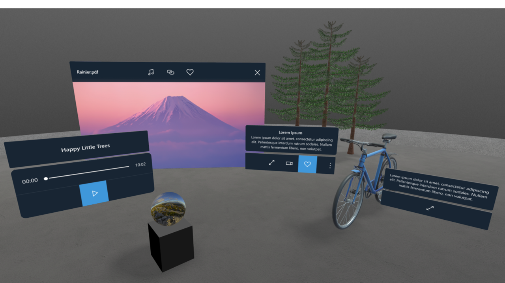

  

# Abstract
Is this what I want? [Project Hiro](/Project-Hiro)

# Interaction model 
- Input and hover states, bounding shape, actions for 3D webparts, navigation and scenes. 
- Inspection / Immersive Mode 
- Controller mapping

# 3D Common Controls
- Atomic 3D controls. DMM.
- Cross-org collaboration. Analog, OMG & BabylonJS to build 3D common controls.
- MR design forum. Fabric MR effort

#### Menu system

  <video width="100%" loop autoplay>
    <source src="./videos/context-menu-01.mp4" type="video/mp4"/>
    Your browser does not support HTML5 video.
  </video>

  <video width="100%" loop autoplay>
    <source src="./videos/context-menu-02-layout-acrylic.mp4" type="video/mp4"/>
    Your browser does not support HTML5 video.
  </video>

  

#### Document Library

  

# Authoring Controls
- Hierarchy explorations
- Property Panel
- Enter & Exit experiences
- Camera control explorations

#### Actions editor

  <video width="100%" loop autoplay>
    <source src="./videos/adding-actions.mp4" type="video/mp4"/>
    Your browser does not support HTML5 video.
  </video>

#### Transform control

  

#### In-situ Object Transform and UI behavior

  

# Sound 
- System sounds
- Ambient sounds
- Audio content
- Welcome message 

# A sample space created using Spaces

  

  <iframe style="border:none;" width="100%" height="640px" src="https://www.exploresharepointspaces.com/sample-classroom" />

