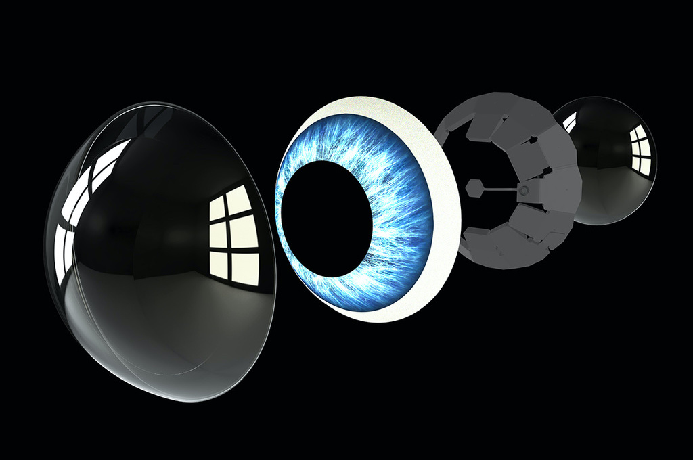
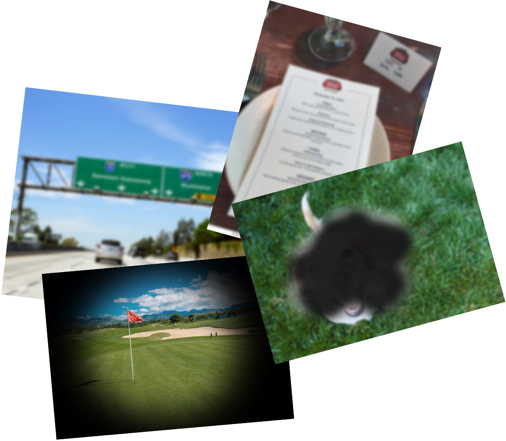
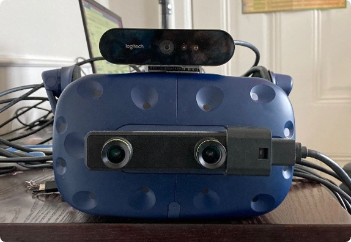

***This is one of several projects I worked on at Mojo Vision. It focuses on the low vision use case — the first and most critical application for the Mojo Lens platform.***

# Mojo Lens for Low Vision

*Creating the world's first eye‑based interface for a medical AR contact lens*

## Overview

| | |
|---|---|
| **Project** | Mojo Lens for Low Vision |
| **Role** | Design & Engineering Lead |
| **Reporting to** | VP of Design, VP of Product |
| **Collaboration** | Hardware, Clinical Science |

I led the Mojo Lens for Low Vision project at Mojo Vision, working at the intersection of UX, engineering, clinical research, and hardware to define and validate the first eye‑gesture–based user interface for an augmented reality contact lens.

The initial and critical target audience for Mojo Lens was low vision users, a group essential to establishing clinical efficacy and de‑risking the path to FDA approval.

## Context: Mojo Lens

  

Mojo Lens was the world's first augmented reality contact lens, integrating a micro‑LED display, imager, motion sensors, batteries, and wireless communication into a scleral lens form factor.

Despite the ambition of the hardware, the product was real and functional — this was not a concept prototype.

With a three‑person UX team, we were responsible for defining how humans would interact with computing directly through the eye.

## The Problem

> How can we improve the quality of life of low‑vision users using the Mojo Vision system?

This challenge came with significant constraints:

- No FDA‑approved studies
- No production hardware capable of running UI
- No defined setup or interaction paradigm
- No clear understanding of which low‑vision users would benefit most

At the same time, the work needed to directly support:

- Clinical efficacy validation
- Usability evaluation
- Hardware and software requirements definition
- A credible roadmap toward FDA approval

## Understanding Low Vision

  

Low vision is not a single condition. Early work focused on understanding and simulating:

- Myopia (nearsightedness)
- Macular degeneration
- Glaucoma
- Low contrast sensitivity

Low‑vision users were the first and most critical users for the product, both ethically and strategically.

## Strategy

The work focused on three parallel goals:

### Clinical Efficacy
- Determine who the system benefits
- Define FDA‑valid clinical tests (acuity, contrast, speed)

### Usability & UX
- Can low‑vision users complete basic tasks?
- How long does it take?
- What interaction models are viable without a screen?

### Requirements Definition
- Translate hardware constraints into software simulations
- Validate minimum FPS, resolution, artifacts, and latency

## Building the Simulation Stack

  

Because no hardware existed to run a UI, I built the best possible simulation of the Mojo Lens experience.

**Setup included:**

- VIVE Pro Eye (eye tracking)
- ZED stereo camera
- External webcam
- Unity 3D
- Custom shaders and filters

**This required:**

- Learning Unity from scratch
- Refreshing 3D vector math
- Simulating lens artifacts such as noise, resolution limits, and pass‑through filtering

## Defining Clinical Tests

Working closely with the clinical team, we defined FDA‑relevant tests measuring:

- Acuity
- Contrast
- Speed

These tests were designed to be:

- Repeatable
- Valid for regulatory submission
- Representative of real‑world use

## Snap & Scan: Core Use Case

One of the most impactful experiences explored was **Snap & Scan**:

- Users capture their environment through the simulated lens
- The system enhances, crops, zooms, and inverts imagery automatically
- Text recognition enables reading signs, labels, and documents

This experience tied together:

- Eye‑based interaction
- Image processing
- Clinical measurement
- Real‑world utility

## Introducing the Phone as a Controller

An important shift came with introducing the phone as:

- A camera
- A controller
- A processing companion

Although initially counter‑intuitive and met with resistance, this approach proved critical. I:

- Designed the interface for non‑visual use (muscle memory–driven)
- Built the app in Flutter
- Used WebSockets to sync images and events over a local network
- Maintained consistent state across devices

## Clinical Study & Results

Initial studies (~10 low‑vision users) showed improvement primarily for users with 20/125+ acuity, but results were mixed.

With the new phone‑based setup, results improved significantly:

- Users achieved effective acuity up to **20/32**
- Faster task completion than phone‑only solutions
- Strong qualitative feedback:

> "Faster than using my phone"

> "I like that I won't be staring into my phone"

> "This is so much better than last time I was here"

## Impact

By the end of the project, we had:

- Built the best simulation of the Mojo Lens
- Validated usability with low‑vision users
- Defined which users benefit most
- Established a clear roadmap toward FDA approval
- Delivered a critical milestone for Series B funding

## Takeaways

- Cross‑functional collaboration across clinical, hardware, and product teams
- Ability to learn anything required to unblock progress
- Turning extreme ambiguity into validated systems
- Driving real‑world impact in regulated, high‑risk environments

## Now

Since 2023, Mojo Vision has pivoted to focus on Micro-LED displays. [Read more](https://www.mojo.vision/news/a-new-direction)
